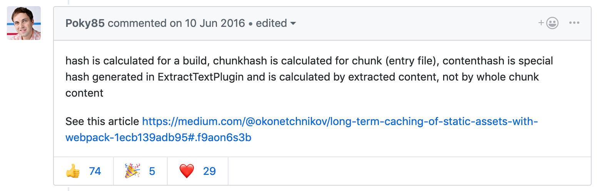

[CodeSplitting](https://www.youtube.com/watch?v=tnwDajQ2Yms)
CodeSplitting at 10:32

[原文](https://github.com/webpack-contrib/extract-text-webpack-plugin/issues/153)

contentHash我没有试过，但是hash和chunkhash我是非常明白了
- hash是计算整个bundle得来的，所以只要有一个文件有改动，所有的文件的hash都会改变
- chunkhash是计算chunk得来的hash，所以每个文件是单独计算的，这样十分有利于LTC（long term cache）

# runtimeChunk
我想说这名字取得太啃爹了，本来以为是一个高大尚的功能，对比了加这个功能和没加这个功能的dist产出，才发现，原来其实就是把一段管理包的代码从bundle中拿了出来，然后没有chunk或者bundle只负责自身逻辑实现，对于公共部分的实现不用管，这个蛮彻底的，详细比较请看关于runtimeChunk部分的解释
