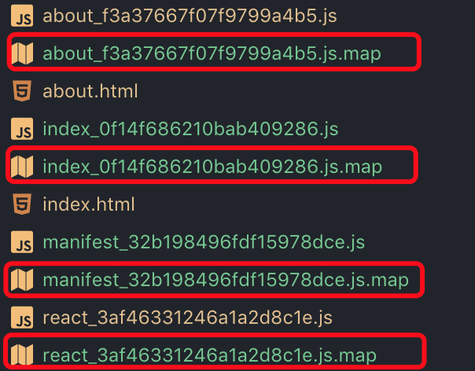

# Optimize - For JS

优化涉及到很多东西，有code-split和minify,因为现在webpack是推行0配置的，所以在mode为production的情况下，webpack会对文件进行自动压缩，对于JS来说就是`uglifyjs`,我对比了一下webpack内置版本和npm的安装版本，两者产出除了变量名称不一样之外，其他基本一致，真是方便，但是如果要对压缩内容进行一些特殊配置，比如sourceMap和一些压缩的option，还是请使用npm安装版本。codeSplit是一定要学高通一下的，这里有些概念如bundle，chunk，hash，chunkhash，runtimeChunk，splitChunks这些，在下面的例子中都会涉及到，所以我花了大力气搞了这些东西，希望能对以后自己的研发之路起到一些帮助

## CodeSplit
我想说，YouTube真是一座宝库，虽然要翻墙，但是非常值得，下面就是Webpack开发组的大神分享的视频，[CodeSplitting](https://www.youtube.com/watch?v=tnwDajQ2Yms)；
在之前chunks这里已经讲过一遍，所以我这里就不重复讲了，只是有些概念之前没有讲到的，下面重点讲一下：

文件名称中的`filename`，`chunkname`，`hash`，`chunkhash`，`runtimeChunks`这些，下面有一个github的提问和回答，但同时我也说一下我的理解：

[原文](https://github.com/webpack-contrib/extract-text-webpack-plugin/issues/153)

### `chunkname`，`hash`,`filename`，`chunkname`
`contentHash`我没有试过，但是hash和chunkhash我是非常明白了
- hash是计算整个bundle得来的，所以只要有一个文件有改动，所有的文件的hash都会改变
- chunkhash是计算chunk得来的hash，所以每个文件是单独计算的，这样十分有利于LTC（long term cache）,所以chunkhash和hash都分开了，所以`filename`和`chunkname`不分开怎么说的过去，毕竟可以设置不同策略

### `runtimeChunk`
我想说这名字取得太坑爹了，本来以为是一个高大尚的功能，对比了加这个功能和没加这个功能的dist产出，才发现，原来其实就是把一段管理包的代码从bundle中拿了出来，然后没有chunk或者bundle只负责自身逻辑实现，对于公共部分的实现不用管，这个蛮彻底的，详细比较请看关于runtimeChunk部分的解释

## 压缩
### `sourceMap`
sourceMap就和名字一样，作用是资源映射，比如和JS编译和uglify之后，就没有办在编译产出物上进行调试了，（这个是书上说的），厉害的像我一样的，就算uglify也没关系，哇哈哈😂😂😂😂😂😂，在`uglifyjs-webpack-plugin`中有一个配置参数就是用来启用`sourceMap`这个功能的，配置如下
```
import UglifyJSPlugin from 'uglifyjs-webpack-plugin';

{
  optimization: {
    optimizer: [
      new UglifyJSPlugin({
        sourceMap: true
      })
    ]
  },
  devtool: 'source-map'
}
```

每个js文件都会生成一个对应的map文件，如下：

